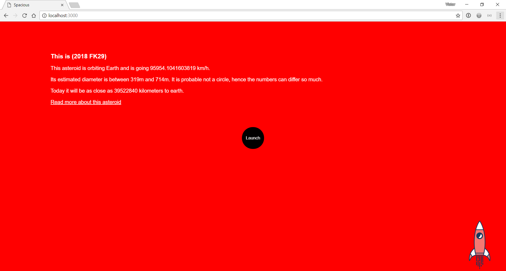
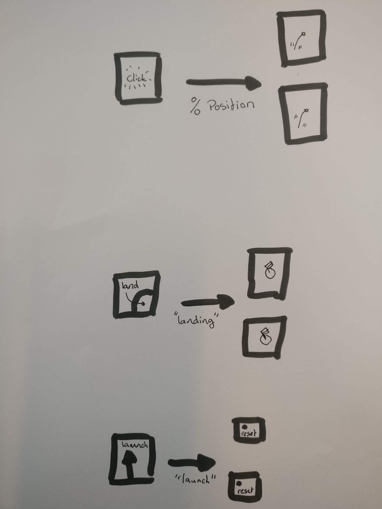
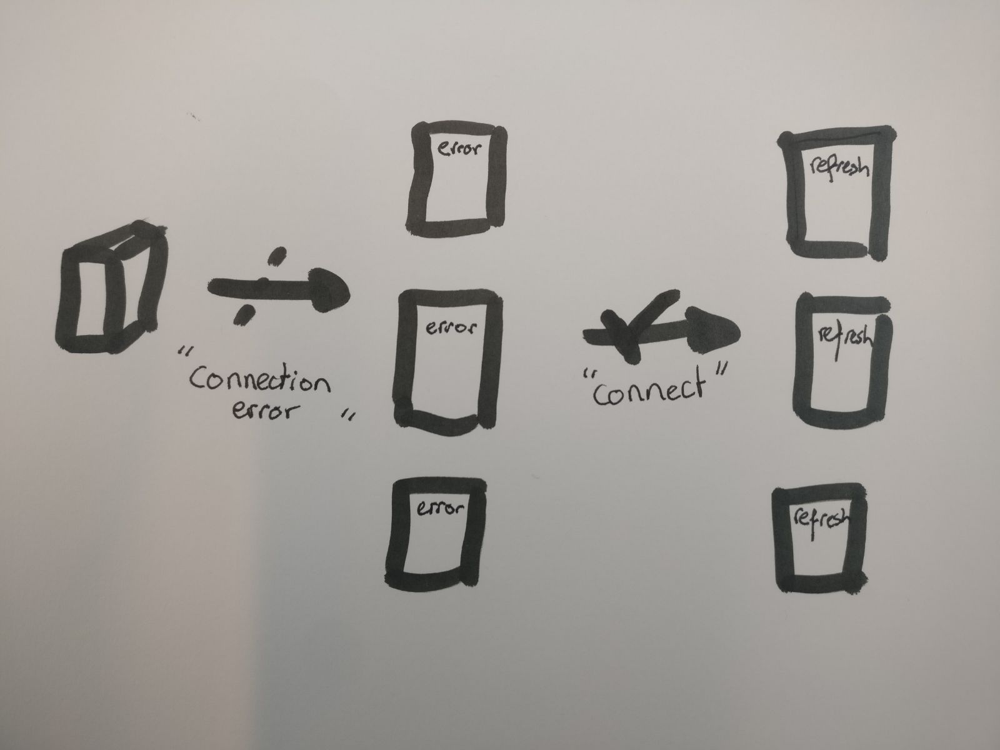
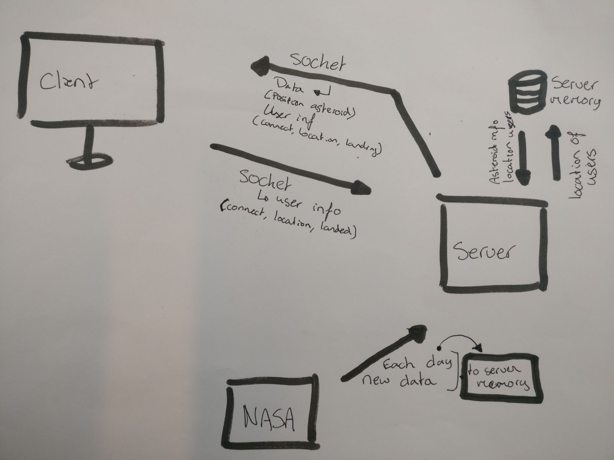

# Spacious

In this application I used the [NASA api](https://api.nasa.gov/api.html). It is a little game to explore neo's (near earth objects.) Each object has its own information.


> [**A sneak peak**](http://spacejs.herokuapp.com/)

# Table of contents
- [Spacious](#spacious)
  * [Background](#background)
  * [Features](#features)
  * [Data-Model](#data-model)
  * [Data](#data)
  * [ToDo](#to-do)
  * [Install](#install)
  * [License](#license)

## Background

This app shows data from the NASA api. Nasa has a big database with information about [NEO's](https://api.nasa.gov/api.html#neows-lookup). Neo's are `near earth objects`. Objects that are that day relatively close to earth.

With the app you can fly trough space with your friends. When located above an asteroid you can land on that certain asteroid. When landed you find all information about that item. The data comes from Nasa and is client-side rendered. 

Each time the server restarts it will position the asteroids differently, but all users see the asteroid on the same place relative to their screen size. 

The rocket is moving in `%`. You can change a few things of the rocket. The speed, top, left, orientation and the hitbox of the asteroid. 

```javascript
const rocket = {
  speed: 1,
  easing: 10,
  top: 0,
  left: 0,
  orientation: 'up'
}
```

The app works with a few players, but never tested with more then four!

## Features


> Detai page in the app

**Client-side detai page**

The detai page of the asteroid is rendered client-side. It will make an element with `createElement` and then put the whole text in with `inserAdjecentHTML`.

```javascript
let astroidSelect = document.querySelector('[data-id="' + data.neo_reference_id + '"]') // <-- Selecting the right astroid
let infoAstroid = document.createElement('article')
infoAstroid.insertAdjacentHTML('afterbegin', text)
astroidSelect.appendChild(infoAstroid)
```

The data is saved on the client. This way you can see information about the asteroid even when you are offline

**Moving the client**

The client checks the moves of the user. It has a switch:

```javascript
switch(clickedKey) {
  case 'ArrowLeft':
    if (rocket.left > 0) {
      rocket.left = rocket.left - rocket.speed
      rocket.orientation = 'left'
    }
    break
  case 'ArrowRight':
    if (rocket.left < 100) {
      rocket.left = rocket.left + rocket.speed
      rocket.orientation = 'right'
    }
    break
  case 'ArrowUp':
    if (rocket.top > 0) {
      rocket.top = rocket.top - rocket.speed
      rocket.orientation = 'up'
    }
    break
  case 'ArrowDown':
    if (rocket.top < 100) {
      rocket.top = rocket.top + rocket.speed
      rocket.orientation = 'down'
    }   
    break
}
```
After this switch it will move the player and emit the position.

**Check collision**

The landing is checked only client-side. When the function is started it will send all the user an message that it is landing (and launching). When landing it will open the astroid. Other users will see a flag icon in the astroid. When launched it will reset the rocket to the top of the screen. 

```javascript
 if (selectRocket.top + selectRocket.height / 2 < data.middle.y + rocket.easing 
    && selectRocket.top + selectRocket.height / 2 > data.middle.y - rocket.easing 
    && selectRocket.left + selectRocket.width / 2 < data.middle.x + rocket.easing 
    && selectRocket.left + selectRocket.width / 2 > data.middle.x - rocket.easing) {
      // Open the astroid. Emit landing
    }
```

**Socket IO**

When the user is doing something it will emit the message. Below an illustration of three `socket.io` emits. 



> Socket handling

This is done client-side and server-side:

```javascript
io.on('event', function () {
  // Start function
})        
```
> client-side

```javascript
socket.on('event', function (data) {
      // Do things with data
    })
    socket.broadcast.emit('event', data)
  })
```
> server-side

**Error handling**

`Socket.io` will send a error, when there is an error with the server. If the server is offline you get an message.

```javascript
io.on('connect_error', function () {
  // Show error message
})
```

When connected again it will refresh the page in 10 seconds

```javascript
this.io.on('connect', function () {
  // Refresh page
})
```


> Error on socket


**Emoji's as classes**

```HTML
<section class="🌌">
  <div class="🚀 client"><div class="image"></div></div>
</section>
```

Space is a section!

## Data model 


> Data model

## Data

The data from NASA I fetched with the node-fetch server-side. 

1. The data is fetched from NASA. The data will then be emitted to all clients so they can use it in their javascript.

2. The user data is stored in the server memory.

3. The NASA data is updated each day.

```javascript
const api = {
  nsaData: function () {
    fetch('https://api.nasa.gov/neo/rest/v1/feed?start_date=' + yyyy + '-' + mm + '-' + dd + '&end_date=' + yyyy + '-' + mm + '-' + dd + '&api_key=' + apiKey)
    .then(function (res) {
      return res.json()
    })
  }
}

```

## To Do

The major thing I have to do is making a good design for the whole app. The style is inconsistent, but it is easy to make that better. (If I had more time).

Next to that you can't see how many people are on one asteroid. This is also a quick fix. It should get all flags in an element. That number is how much people are on that asteroid.

Putting a database behind the server it will make it easier to keep the users information. Next to that it will be easier to set a name of a user and let them keep that name. 

## Install

1. Clone the repo: `git clone git@github.com:velomovies/real-time-web.git`
2. Get all the dependencies `npm install`
3. Run `npm start`  to start the server.
4. Navigate to`localhost:3000` to see the application.

**Prerequisites**

- Git
- Node
- NPM

**Dependencies**

- [Socket.io](https://socket.io) is used to make connecting to the websocket easier
- [Nunjucks](https://mozilla.github.io/nunjucks/) for templating
- [Fetch](https://www.npmjs.com/package/node-fetch) for getting data from nasa
- [Dotenv](https://www.npmjs.com/package/dotenv) for a working .env

## License

Detai is spelled correctly. [detai](detai.nl)

GPL-3.0 © Victor Zumpolle
