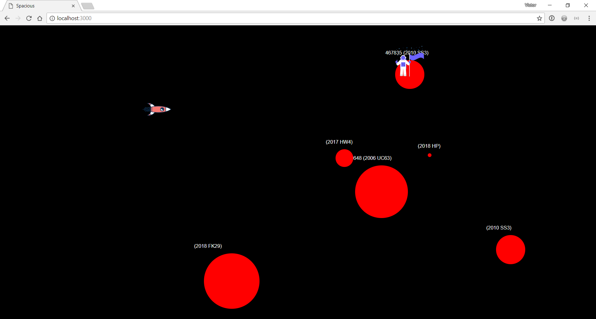

# Spacious

In this application I used the [NASA api](https://api.nasa.gov/api.html). It is a little game to explore neo's (near earth objects.) Each object has its own information.

> [**A sneak peak**](link)

- [Spacious](#spacious)
  * [Background](#background)
  * [Features](#features)
  * [Data](#data)
  * [ToDo](#to-do)
  * [Install](#install)
  * [License](#license)

## Background

This app shows data from the NASA api. 

## Features

## Data

## To Do

## Install

## License

GPL-3.0 © Victor Zumpolle
